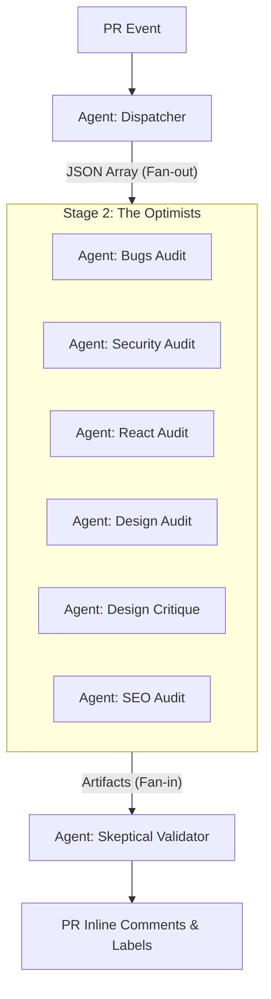

# Agent Swarm Architecture: woo-review

This document defines the roles, responsibilities, and operational protocols for the AI agent swarm that powers `woo-review`. Every agent operating in this codebase MUST adhere to these definitions.

## 1. Orchestration Model: Parallel Matrix

The system follows a **Three-Stage Parallel Pipeline**. This architecture separates the "discovery" of potential issues from the "validation" of real ones to maximize both speed and accuracy.

---

## 2. Agent Roles & Personas

### 2.1 The Dispatcher (Detector)
*   **Persona**: Efficient Traffic Controller.
*   **Responsibility**: Analyzes the PR diff and repository metadata to determine which review angles are applicable.
*   **Operational Mandate**: Minimize false-positives at the detection stage. Do not trigger a `react` audit if the PR only touches CSS.

### 2.2 The Optimists (Auditors)
The Auditor agents are designed to be **thorough and optimistic**. Their goal is to find *any* potential issue within their specific domain.

| Agent | Responsibility | Primary Lens |
|---|---|---|
| **Bugs Auditor** | Functional Correctness | Compile errors, logic traps, resource leaks, race conditions. |
| **Security Auditor** | Trust & Safety | OWASP Top 10, injection, bypasses, hardcoded secrets, data exposure. |
| **React Auditor** | Component Lifecycle | Prop-types, hooks rules, unnecessary re-renders, state management. |
| **Design Auditor** | Technical UI Quality | Token usage, WCAG contrast, spacing scales, [impeccable](https://github.com/pbakaus/impeccable) anti-patterns. |
| **Design Critique** | UX & Heuristics | Nielsen's 10, cognitive load, layout hierarchy, interaction polish. |
| **SEO Auditor** | Discoverability | [coreyhaines31/seo-audit](https://www.skills.sh/coreyhaines31/marketingskills/seo-audit) framework: Crawlability, Technical, On-Page, E-E-A-T. |

### 2.3 The Skeptic (Validator)
*   **Persona**: The "Defense Attorney" for the Code.
*   **Responsibility**: Acts as a high-reasoning filter for the combined raw findings of the Auditors.
*   **Core Logic**:
    *   **Deduplication**: Merges overlapping findings from different angles.
    *   **In-Diff Enforcement**: Discards any findings that pre-date the PR.
    *   **Noise Reduction**: Discards pedantic nits, subjective "maybe" issues, or lint-catchable warnings.
*   **Operational Mandate**: Protect the developer's attention. If a finding is not 100% certain or blocking, it must be either downgraded or discarded.

---

## 3. Communication Protocols

### 3.1 The Handoff Contract
All agents communicate via standardized JSON artifacts in `/tmp/pr-review/`.

- **Input Metadata**: `meta.json` (PR title, body, file list).
- **Primary Source**: `diff.txt` (The raw patch).
- **Rules**: `rules.md` (Constitution + CLAUDE.md files).
- **Findings**: `findings.<angle>.json` -> Merged to `raw_findings.json`.

### 3.2 Model Mapping (May 2026 Standards)
To maintain the efficiency of the swarm, we match task complexity to model capability:
- **Reasoning (Validator)**: Claude Opus 4.7 / GPT-5.5.
- **Auditing (Workers)**: Claude Sonnet 4.6.
- **Metadata (Dispatcher)**: Gemini 3.5 Flash.

---

## 4. Operational Mandates for Developers

When modifying agent prompts or logic, you MUST:
1.  **Maintain Separation of Concerns**: Do not add security checks to the Bugs Auditor.
2.  **Respect the Skeptic**: Ensure the Validator has enough context (the original diff) to challenge the Auditors.
3.  **Validate the Schema**: Every finding MUST include `angle`, `file`, `line`, `severity`, `blocking`, and `description`.
4.  **No Hallucinations**: Prompt auditors to cite exact code or rules when raising a `blocking: true` finding.
