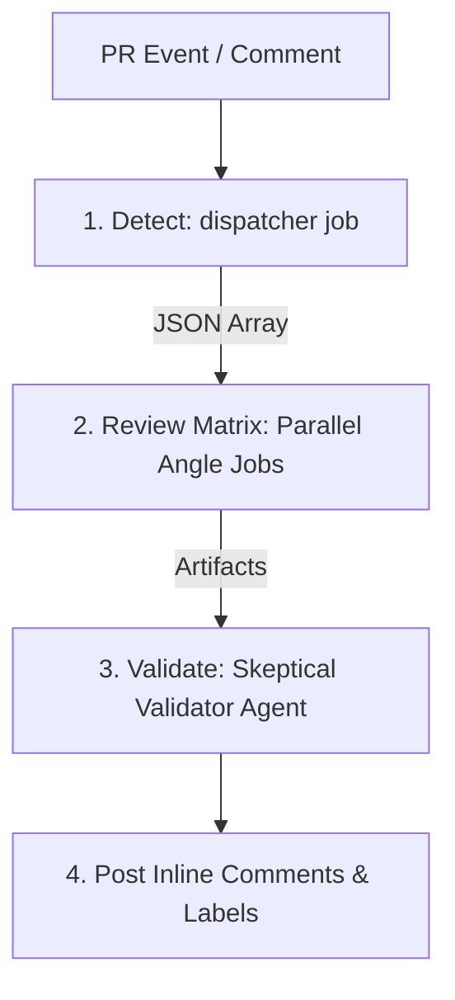

# woo-review

Reusable GitHub Action that runs an agentic AI pull request review and dispatches to the **first-party action of your chosen provider**. Optimized for the **May 2026** AI landscape, it uses a parallel matrix-based architecture with a "Skeptical Validator" to deliver maximum speed and accuracy.

## Architecture: The Parallel Pipeline

Unlike traditional sequential reviewers, `woo-review` uses a three-stage parallel pipeline:

1.  **Detect (Dispatcher)**: Analyzes the diff to identify relevant **Review Angles** (Bugs, Security, SEO, etc.).
2.  **Review (Matrix)**: Dispatches $N$ specialized agents in parallel via GitHub Actions Matrix. Each agent focuses on a single "Optimistic Audit" of its assigned angle.
3.  **Validate (Skeptical Auditor)**: A high-reasoning **Skeptical Validator** agent (Claude Opus 4.7) collects all findings, dedupes them, and performs a "defense attorney" audit to eliminate noise and false positives.



## Features

-   **Maximum Speed**: Parallel execution via GHA Matrix reduces review time by up to 80% for complex PRs.
-   **High Accuracy**: Skeptical Validator pass eliminates "hallucinated" nits and pedantic suggestions.
-   **Model Optimization**: Automatically maps tasks to the best 2026 models (Opus 4.7 for reasoning, Flash 3.5 for speed).
-   **Multi-Provider**: Supports Anthropic, OpenAI, Google, and OpenRouter.
-   **Integrated Tooling**: Runs `react-doctor` and `impeccable` (visual audit) natively within the agentic loop.

## Quickstart (Recommended: Parallel Mode)

To get the full benefit of parallelism, use the provided **Reusable Workflow**:

```yaml
# .github/workflows/ai-review.yml
name: AI PR Review
on:
  pull_request:
    types: [opened, reopened, ready_for_review]
  issue_comment:
    types: [created]

jobs:
  review:
    uses: howarewoo/woo-review/.github/workflows/reusable-review.yml@main
    with:
      provider: anthropic
    secrets:
      # Map your preferred provider secret
      anthropic_token: ${{ secrets.CLAUDE_CODE_OAUTH_TOKEN }}
```

## Angles

| Angle | Always-on | Detection trigger | Tooling |
|---|---|---|---|
| `bugs` | yes | — | LLM only |
| `security` | yes | — | LLM only |
| `seo` | no | `*.html`, `head.{ts,tsx}`, `layout.{ts,tsx}`, `robots.txt`, `sitemap.{xml,ts}`, `next.config.*`, `app/manifest.*`, OR diff tokens | LLM only |
| `design` | no | `*.{tsx,jsx,vue,svelte,html,css,scss,sass,less,styl,astro}` | LLM + `impeccable detect` |
| `react` | no | `*.{tsx,jsx}` AND `react` dep in `package.json` | `react-doctor` + LLM |

## Provider Support (May 2026 Flagships)

`woo-review` defaults to the latest state-of-the-art models for maximum reliability.

| Provider | Default Worker Model | Default Validator Model | Key inputs |
|---|---|---|---|
| `anthropic` | `claude-sonnet-4-6` | `claude-opus-4-7` | `anthropic_token` |
| `openai` | `gpt-5-5-instant` | `gpt-5-5` | `openai_api_key` |
| `google` | `gemini-3-5-flash` | `gemini-3-1-pro` | `google_api_key` |
| `openrouter` | `sonnet-4-6` | `opus-4-7` | `openrouter_api_key` |

## Inputs & Configuration

| Name | Default | Notes |
|---|---|---|
| `mode` | `full` | `full` (sequential), `detect`, `review`, or `validate`. Reusable workflow handles this automatically. |
| `provider` | `""` | `anthropic`, `openai`, `google`, `openrouter`. |
| `blocking_label` | `blocking-review` | Label applied when a blocking finding is detected. |
| `disable_angles` | `""` | Comma-separated list of optional angles to skip (`seo`, `design`, `react`). |
| `max_turns` | `30` | Turn cap for agentic loops. |

## Rules and Style Guides

The action reads `constitution.md` from your repo root plus every `CLAUDE.md` file in the directories touched by the PR. They are concatenated and fed to the reviewer as the primary source of truth for "Project Norms."

## Output

1.  **Inline Comments**: Posted via `gh api` with optional `suggestion` blocks.
2.  **Status Line**: A bold summary in the PR body (e.g., `**Status: CHANGES REQUESTED** — 2 blocking findings`).
3.  **Blocking Label**: Adds `blocking-review` to the PR if critical issues are found, allowing you to gate merges via branch protection rules.

## Security

When using `pull_request_target` (write-scope event), always pin the action to a full commit SHA to prevent supply-chain attacks.

## License

MIT.
