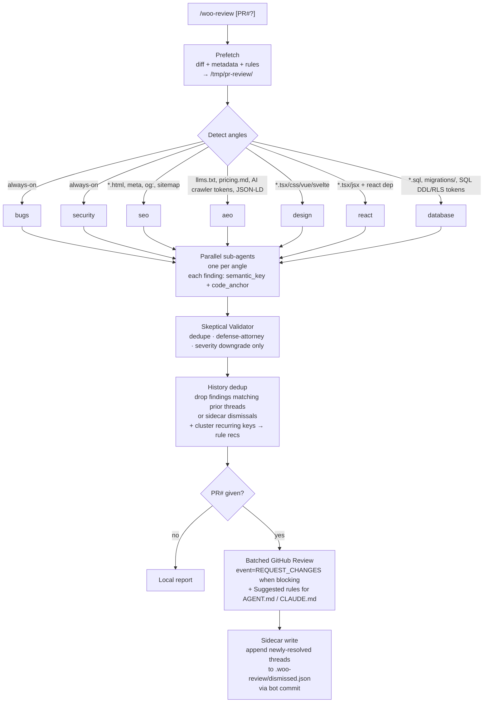

# woo-review

A portable AI **skill** that turns any coding agent into a parallel PR review swarm. One slash command spawns specialized sub-agents (bugs, security, SEO, design, React, database), runs a skeptical validator, dedupes findings against prior review history, and — if you point it at a GitHub PR — posts a single batched review.

The companion GitHub Action is an **extension** of the skill: same prompts, same angles, same validator, just packaged for CI.

**Idempotent across runs.** Re-running on the same PR will not re-post findings that already match an open or resolved thread, a sidecar dismissal, or a line-shifted version of a prior finding. When a recurring `semantic_key` pattern is detected, the review body suggests short rules to add to `AGENT.md` / `CLAUDE.md` so coding agents catch the issue upfront on the next pass.

---

## Install (skill)

```bash
npx skills add howarewoo/woo-review
```

Requires `gh`, `jq`, `node` on PATH. Optional power-ups: `pbakaus/impeccable`, `coreyhaines31/seo-audit`.

## Use (skill)

```text
/woo-review            # Auto-detect: if current branch has an open PR, behave as /woo-review <PR#>; else review local diff against origin/main
/woo-review 123        # Fetch PR #123, run the swarm, post a native GitHub Review
woo-review install     # Verify deps + warm npx caches
woo-review status      # Show current PR review state
```

When you invoke `/woo-review` the host agent:

1. **Prefetches** diff + metadata + rules + prior review threads (open + resolved) + sidecar dismissals into `/tmp/pr-review/`.
2. **Detects** which angles apply (always-on: `bugs`, `security`; conditional: `seo`, `aeo`, `design`, `react`, `database`).
3. **Spawns one sub-agent per angle in parallel** (Claude Code Task, Cursor subagents, Gemini CLI sequential loop fallback — host-agnostic). Each finding carries `semantic_key` + `code_anchor` for stable identity across runs.
4. **Validates** all findings through a Skeptical Validator pass (dedupe, defense-attorney audit, severity downgrade only).
5. **Dedupes against history** — drops findings whose `(file, code_anchor, semantic_key)` matches a prior thread or sidecar entry; LLM tiebreak handles ambiguous near-matches. Recurring `semantic_key` clusters trigger a short "Suggested rules for AGENT.md / CLAUDE.md" section in the review body.
6. **Reports** locally OR posts one batched GitHub Review when a PR# was given. After posting, newly-resolved threads are recorded to `.woo-review/dismissed.json` (when `enable_sidecar_write` is on).



See [`skills/woo-review/SKILL.md`](./skills/woo-review/SKILL.md) for the full workflow contract.

---

## Knowledge aggregation

The skill calls into established domain tools instead of re-implementing them:

| Source | Used by angle | Mechanism |
|---|---|---|
| [coreyhaines31/ai-seo](https://www.skills.sh/coreyhaines31/marketingskills/ai-seo) | `aeo` | Embedded as the rubric in `skills/woo-review/prompts/angles/aeo.md`; deeper `references/` fetched on demand via `gh api` |
| [coreyhaines31/seo-audit](https://www.skills.sh/coreyhaines31/marketingskills/seo-audit) | `seo` | Embedded as the rubric in `skills/woo-review/prompts/angles/seo.md` |
| [millionco/react-doctor](https://github.com/millionco/react-doctor) | `react` | `npx -y react-doctor --diff <base> --offline` |
| [openai/security-best-practices](https://www.skills.sh/openai/skills/security-best-practices) | `security` | Language/framework-specific rubric loaded from `openai/skills` `references/`; fetched on demand via `gh api` if not installed locally |
| [pbakaus/impeccable](https://github.com/pbakaus/impeccable) | `design` | `npx -y impeccable detect --json` (one run, drives quant + qual passes) |
| [supabase/supabase-postgres-best-practices](https://www.skills.sh/supabase/agent-skills/supabase-postgres-best-practices) | `database` | Referenced from `skills/woo-review/prompts/angles/database.md`; rule families (`security-*`, `query-*`, `schema-*`, `conn-*`, `lock-*`, `data-*`) fetched on demand via `gh api` |

The audit rubrics live in `skills/woo-review/prompts/` so the skill is self-sufficient — recommended skills only enrich the host agent's general vocabulary.

---

## Angles

| Angle | Always-on | Detection trigger | Tooling |
|---|---|---|---|
| `bugs` | yes | — | LLM only |
| `security` | yes | — | LLM + `openai/security-best-practices` rubric |
| `seo` | no | `*.html`, `head.{ts,tsx}`, `layout.{ts,tsx}`, `robots.txt`, `sitemap.{xml,ts}`, `next.config.*`, `app/manifest.*`, or `<meta>`/`og:`/`canonical` tokens in diff | LLM + `coreyhaines31/seo-audit` rubric (embedded in `skills/woo-review/prompts/angles/seo.md`) |
| `aeo` | no | `robots.txt`, `llms.txt`, `pricing.{md,txt}`, `*.{md,mdx,html}`, or diff body contains AI-crawler tokens (`GPTBot`, `PerplexityBot`, `ClaudeBot`, `Google-Extended`, `anthropic-ai`) or JSON-LD `FAQPage`/`HowTo`/`Article`/`Product`/`ItemList`/`Review` types | LLM + `coreyhaines31/ai-seo` rubric (embedded in `skills/woo-review/prompts/angles/aeo.md`) |
| `design` | no | `*.{tsx,jsx,vue,svelte,html,css,scss,sass,less,styl,astro}` | LLM + `impeccable detect` (one run; quantitative pass from JSON, qualitative critique scoped to flagged files) |
| `react` | no | `*.{tsx,jsx}` AND `react` in `package.json` | `react-doctor` + LLM |
| `database` | no | `*.sql`, `(db\|supabase\|prisma)/migrations/`, `prisma/schema.prisma`, `drizzle.config.*`, `drizzle/`, `knexfile.*`, `supabase/(config.toml\|seed.sql)`, OR SQL DDL / RLS tokens / Supabase client / ORM raw-SQL call sites in diff | LLM + `supabase/supabase-postgres-best-practices` rubric (fetched via `gh api`) |

---

## CI extension: the GitHub Action

The same skill, packaged as a GHA reusable workflow for repos that want reviews on every PR without anyone running a slash command.

```yaml
# .github/workflows/ai-review.yml
name: AI PR Review
on:
  pull_request:
    types: [opened, reopened, ready_for_review]
  issue_comment:
    types: [created]

jobs:
  review:
    # Pinned to the v0.1.0 tag. Production: replace with the full commit SHA (see Security section).
    uses: howarewoo/woo-review/.github/workflows/reusable-review.yml@v0.1.0
    with:
      provider: anthropic
    secrets:
      anthropic_token: ${{ secrets.CLAUDE_CODE_OAUTH_TOKEN }}
```

Zero local setup in the consumer repo — the action ships its own Node tools and prompts. Full template at [`examples/workflows/ai-review.yml`](./examples/workflows/ai-review.yml).

The CI pipeline mirrors the skill's swarm 1:1 — detection job → matrix of angle workers → validator → batched review.

### Provider matrix (May 2026 defaults)

| Provider | Worker model | Validator model | Secret |
|---|---|---|---|
| `anthropic` | `claude-sonnet-4-6` | `claude-opus-4-7` | `anthropic_token` |
| `openai` | `gpt-5-5-instant` | `gpt-5-5` | `openai_api_key` |
| `google` | `gemini-3-5-flash` | `gemini-3-1-pro` | `google_api_key` |
| `openrouter` | `deepseek/deepseek-v4-flash` | `deepseek/deepseek-v4-pro` | `openrouter_api_key` |

### Inputs

| Name | Default | Notes |
|---|---|---|
| `provider` | `""` | `anthropic`, `openai`, `google`, `openrouter`. Auto-detected from supplied secret. |
| `mode` | `full` | `full`, `detect`, `review`, `validate`. Reusable workflow handles wiring. |
| `disable_angles` | `""` | CSV of optional angles to skip (e.g. `seo,aeo,design,react,database`). `bugs` and `security` are non-negotiable. |
| `max_turns` | `30` | Agent loop cap (Anthropic; other providers use their equivalent). |
| `enable_history_dedup` | `true` | Run `dedup-against-history.sh` between validator and posting. Set `false` to fall back to legacy `findings.json` consumption. |
| `enable_sidecar_write` | `false` | After review POST, append newly-resolved threads to `.woo-review/dismissed.json` and commit via bot. Requires `contents: write`. Flip on after a dogfood window. |

---

## Output

Whether triggered locally or via CI:

1. **Inline review comments** — one batched `gh api ... /pulls/<N>/reviews` POST with `suggestion` blocks where applicable. Findings duplicating prior PR threads (open or resolved) or sidecar dismissals are dropped before posting.
2. **Status line** in the review body: `**Status: APPROVED** / APPROVED WITH SUGGESTIONS / CHANGES REQUESTED — counts.`
3. **Native review event** — `REQUEST_CHANGES` when any validated finding is blocking OR when any prior thread is still `status: open`; `COMMENT` when only non-blocking findings exist; `APPROVE` when none and no open prior threads. Resolved priors are dedup signal only — they no longer floor the event. Wire branch protection to "Require approval of the most recent reviewable push" or the `pull-request-review` required check to gate merges.
4. **Suggested rules for AGENT.md / CLAUDE.md** — appended to the review body when ≥`WOO_REVIEW_RULES_THRESHOLD` (default 2) findings across this run and the sidecar share a `semantic_key`. Lets coding agents learn from recurring issues upfront on the next pass.

The action never modifies the PR title, description, or labels.

### History dedup & sidecar

Every finding emits two fields used for stable identity across runs:

- `semantic_key` — kebab-case `<angle>/<issue-type>` (≤40 chars), from the per-angle enum in `skills/woo-review/prompts/angles/*.md`.
- `code_anchor` — first 12 hex chars of `shasum -a 1` over the 3 lines before + the finding line + the 3 lines after. Survives line shifts in unrelated code.

`dedup-against-history.sh` runs between the validator and the posting step:

- **Pass 1 (deterministic)** — drop any new finding whose `(file, code_anchor, semantic_key)` triple matches a prior PR thread or sidecar entry.
- **Pass 2 (LLM tiebreak)** — for ambiguous cases (same file, |Δline| ≤ 10, exactly one of anchor/sem_key matches), one Sonnet call returns a keep/drop verdict. Batched 20 pairs/call, hard-capped at 10 calls/run. Fails open on any error.

When `enable_sidecar_write: true`, the script also writes newly-resolved threads to `.woo-review/dismissed.json` via a bot commit so dedup signal survives across PRs. See [`skills/woo-review/SKILL.md`](./skills/woo-review/SKILL.md) under "History Dedup & Rule Recommendations" for the artifact lifecycle.

---

## Security

When wiring the action behind `pull_request_target` (write-scope), always pin to a full commit SHA to defend against supply-chain attacks. See [GitHub's hardening guide](https://docs.github.com/en/actions/security-guides/security-hardening-for-github-actions).

## Project docs

- Skill contract: [`skills/woo-review/SKILL.md`](./skills/woo-review/SKILL.md)
- Agent mandates: [`AGENTS.md`](./AGENTS.md)

## License

MIT.
