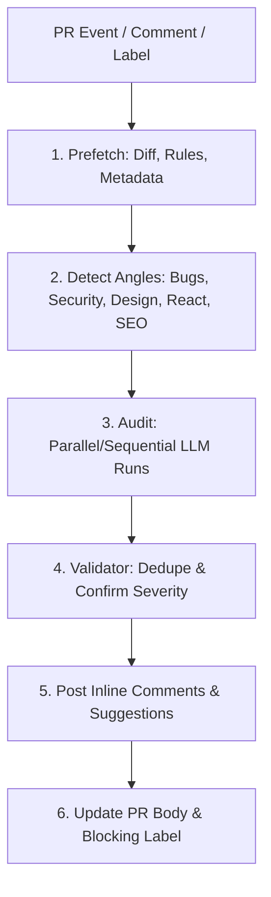

# woo-review

Reusable GitHub Action that runs an agentic AI pull request review and dispatches to the **first-party action of your chosen provider**. Pick Anthropic, OpenAI, Google, or OpenRouter; bring your own API key; get inline review comments, a status line in the PR body, and a blocking label that fails CI when problems are real.

The review pipeline is the same across providers:

1. Prefetch diff, metadata, and rules (`constitution.md` + applicable `CLAUDE.md` files).
2. Audit lens A: constitution + bug detection.
3. Audit lens B: security + logic.
4. Self-validation to drop false positives and confirm severity.
5. Post inline comments with optional `suggestion` blocks.
6. Update PR body with `STATUS_LINE`. Add or remove `blocking-review` label.



Anthropic uses Claude Code's native `Task` tool to run the two audit lenses as parallel subagents. The other providers run them sequentially in a single agentic loop (same output contract).

## Quickstart

```yaml
# .github/workflows/pr-review.yml
name: PR Review
on:
  pull_request:
    types: [opened, reopened, ready_for_review]
  issue_comment:
    types: [created]

jobs:
  review:
    runs-on: ubuntu-latest
    permissions:
      contents: read
      pull-requests: write
      id-token: write
    steps:
      - uses: actions/checkout@v6
        with:
          fetch-depth: 1

      - uses: howarewoo/woo-review@v1
        with:
          provider: anthropic
          anthropic_token: ${{ secrets.CLAUDE_CODE_OAUTH_TOKEN }}
```

Pin to a specific SHA for production use, especially when triggering on `pull_request_target` (see Security below).

## Provider Selection

`provider` is optional. When omitted, the action picks the first provider whose API key input is set, in this order: `anthropic` → `openai` → `google` → `openrouter`. Setting `provider` explicitly overrides auto-detection.

| Provider | Underlying action | Default model | Key inputs |
|---|---|---|---|
| `anthropic` | `anthropics/claude-code-action@v1` | `claude-sonnet-4-6` | `anthropic_token` (preferred) or `anthropic_api_key` |
| `openai` | `openai/codex-action@v1` | `gpt-5` | `openai_api_key` |
| `google` | `google-github-actions/run-gemini-cli@v0` | `gemini-2.5-pro` | `gemini_api_key` or `google_api_key` |
| `openrouter` | `sst/opencode/github@latest` | `openrouter/anthropic/claude-sonnet-4` | `openrouter_api_key` |

## Inputs

| Name | Default | Notes |
|---|---|---|
| `provider` | `""` | One of `anthropic`, `openai`, `google`, `openrouter`. Auto-detected when empty. |
| `model` | provider default | Passed through to the runner. For OpenRouter, use `openrouter/<model>`. |
| `anthropic_token` | `""` | Preferred Anthropic credential (Claude Code OAuth token). |
| `anthropic_api_key` | `""` | Anthropic API key (alternative). |
| `openai_api_key` | `""` | OpenAI API key. |
| `gemini_api_key` / `google_api_key` | `""` | Gemini API key (either input works). |
| `openrouter_api_key` | `""` | OpenRouter API key. |
| `trigger_phrase` | `@review` | Phrase that triggers review in a PR comment. |
| `blocking_label` | `blocking-review` | Label applied when a blocking finding is detected; CI fails when present. |
| `constitution_path` | `constitution.md` | Repo-relative path to your rules file. Missing file is tolerated. |
| `max_turns` | `30` | Anthropic-specific cap; ignored by other runners. |
| `skip_labels` | `""` | Comma-separated label list that force-skips the review. |
| `prompt_override` | `""` | Path (relative to your repo) to a custom prompt that replaces the bundled per-provider prompt. The shared output-contract header is still prepended. |

## Triggers

The action does not declare its own `on:` block — that lives in the consumer workflow. Recommended triggers:

- `pull_request` — types `[opened, reopened, ready_for_review]` for automatic review on new PRs.
- `pull_request_target` — types `[labeled]` for opt-in review via a label.
- `issue_comment` — types `[created]` so a teammate can write `@review` in a PR comment to re-trigger.

The bundled `prefetch.sh` enforces a re-run guard: when an AI bot has already commented and the trigger is not explicit (label, comment mention, manual dispatch), the run is skipped.

## Rules and Style Guides

The action reads `constitution.md` from your repo root (or the path you provide) plus every `CLAUDE.md` file in or above the directories touched by the PR. They're concatenated into `/tmp/pr-review/rules.md` and fed to the reviewer. CLAUDE.md rules only apply to changed files at or below the rules file's directory.

## Output

For each validated finding, the action posts an inline review comment via `gh api ... /pulls/<N>/comments`. The PR body gets a `STATUS_LINE`:

- `**Status: CHANGES REQUESTED** — N blocking finding(s) ...`
- `**Status: APPROVED WITH SUGGESTIONS** — N non-blocking finding(s) ...`
- `**Status: APPROVED** — No validated findings.`

When at least one finding is blocking, the action adds the `blocking_label` label. The action's last step reads PR labels and exits non-zero when the label is present, so this surfaces as a failing required check in branch protection.

## Security

When triggering on `pull_request_target` (write-scope event), pin the action to a SHA:

```yaml
- uses: howarewoo/woo-review@<full-commit-sha>
```

`pull_request_target` runs in the context of the base branch with repo write tokens. Pinning prevents a malicious tag retarget from reaching your secrets.

## Custom Prompts

Provide `prompt_override:` with a repo-relative path to a Markdown file. Your file replaces the bundled per-provider prompt, but the shared `_header.md` (artifact paths, output contract, blocking criteria, do-NOT-flag list) is still prepended. Use this when you want to extend the orchestration without rewriting the output contract.

## Local Development

```bash
# Run the prefetch step manually against a local PR checkout
INPUT_CONSTITUTION_PATH=constitution.md \
PR_NUMBER=123 \
EVENT_NAME=pull_request \
EVENT_ACTION=opened \
GH_TOKEN="$(gh auth token)" \
GITHUB_REPOSITORY=owner/repo \
bash scripts/prefetch.sh
```

The four runner steps are external `uses:` actions, so `act` only validates the script steps locally.

## License

MIT.
